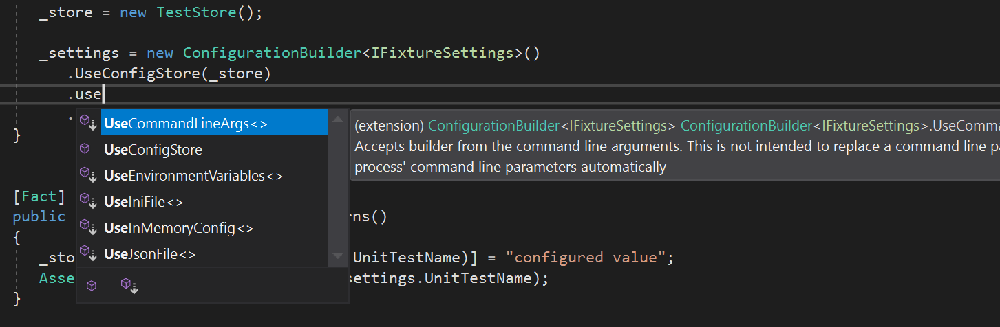

# Config.Net [](https://www.nuget.org/packages/Config.Net) [](https://ci.appveyor.com/project/aloneguid/config) [](https://gitter.im/aloneguid/config?utm_source=badge&utm_medium=badge&utm_campaign=pr-badge&utm_content=badge)

A comprehensive easy to use and powerful .NET configuration library, fully covered with unit tests and tested in the wild on thousands of servers and applications.

This library eliminates the problem of having configuration in different places, having to convert types between different providers, hardcoding configuration keys accross the solution, depending on specific configuration source implementation. It's doing that by exposing an abstract configuration interface and providing most common implementation for configuration sources like app.config, environment variables etc.


## Index

- Quick Start (this page)
- [Supported Types](doc/SupportedTypes.md)
- Configuration Sources
  - [App.config](doc/Stores_AppConfig.md)
  - [App.config custom section](doc/Stores_AppConfigSection.md)
  - [Command Line](doc/Stores_CommandLine.md)
  - [Environment Variables](doc/Stores_EnvironmentVariables.md)
  - [.INI files](doc/Stores_IniFile.md)
  - [In-Memory](doc/Stores_InMemory.md)
  - [JSON Files](doc/Stores_JsonFile.md)
  - [Storage.Net Integration](doc/Stores_StorageNet.md)
- [Nested Interfaces](doc/NestedInterfaces.md)
- [Collections](doc/Collections.md)
- [Binding to Interface Methods](doc/DynamicConfiguration.md)
- Extending Config.Net
  - [Implementing a custom parser](doc/CustomParsers.md)
  - [Implementing a custom configuration store](doc/Stores_Custom.md)

## Quick Start

Usually developers will hardcode reading cofiguration values from different sources like app.config, local json file etc. For instance, consider this code example:

```csharp
var clientId = ConfigurationManager.AppSettings["AuthClientId"];
var clientSecret = ConfigurationManager.AppSettings["AuthClientSecret"];
```

You would guess that this code is trying to read a configuration setting from the local app.config file by name and that might be true, however there are numerous problems with this approach:

* settings are referenced by a hardcoded string name which is prone to typos and therefore crashes in runtime.
* there is no easy way to find out where a particular setting is used in code, except for performing a fulltext search (provided that the string was not mistyped)
* if you decide to store configuration in a different place the code must be rewritten.

Welcome to Config.Net which solves most of those problems. Let's rewrite this abomination using Config.Net approach. First, we need to define a configuration container which describes which settings are used in your application or a library:


### Declare settings interface

```csharp
using Config.Net;

public interface IMySettings
{
    string AuthClientId { get; }

    string AuthClientSecret { get; }
}
```

These interface members describe the values you are using in code and look exactly like anything else in the code. You can pass this interface around inside your application like nothing happened.

In order to instantiate this interface and bind it to application settings use `ConfigurationBuilder<T>` class:

```csharp
IMySettings settings = new ConfigurationBuilder<IMySettings>()
   .UseAppConfig()
   .Build();
```

This is literally all you have to do. Configuration builder is an entry to creating instances of your interface and underneath it creates a proxy class which intercepts calls to properties and fetches values from underlying configured stores.

Not all of the types can be used in the properties, because Config.Net needs to know how to convert them to and from the underlying stores. [This list](doc/SupportedTypes.md) is growing though, and you can always [create a new one](doc/CustomParsers.md) (please don't forget to contribute back to Config.Net).


### Using Multiple Sources

`ConfigurationBuilder<T>` is used to instantiate your configuration interface. You can use it to add multiple configuration sources. To get the list of sources use IntelliSense (type dot-Use):



The order in which sources are added is important - Config.Net will try to read the source in the configured order and return the value from the first store where it exists.

### Changing property behavior

`Option` attribute can be used to annotate interface properties with extra bahavior.

#### Aliases

In case your property is named different to C# property name you can alias it:

```csharp
public interface IMySettings
{
   [Option(Alias = "clientId")]
   string AuthClientId { get; }
}
```

which makes Config.Net to look for "clientId" when reading or writing.

#### Default values

When a property doesn't exist in any of the stores or you just haven't configured any stores at all, you will receive a default value for the property type (0 for int, null for string etc.). However, it's sometimes useful to have a different value returned as a default instead of handling that in you code. In order to do that you can use the `DefaultValue` property on the attribute:

```csharp
public interface IMySettings
{
   [Option(Alias = "clientId", DefaultValue = "n/a")]
   string AuthClientId { get; }
}
```

Now when reading the value will be read as `n/a` instead of just `null`. DefaultValue property is of type `object` therefore the type of the value you assign to it must match the property type. If this is not the case, you will receive `InvalidCastException` explaining where the problem is during the `.Build()` stage.

However, you can set the property value to `string` no matter what the type is, as long as it's parseable to that type in runtime using any of the parsers.


### Writing Settings

Some configuration stores support writing values. You can write the value back by simply setting it's value:

```csharp
c.AuthClientId = "new value";
```

Config.Net will write the value to the first store which supports writing. If none of the stores support writing the call will be ignored.

Of course in order for a property to be writeable you need to declare it as such in the interface:

```csharp
string AuthClientId { get; set; }
```

Proudly using [Jetbrains Rider](https://www.jetbrains.com/rider/) for Open Source Development.

