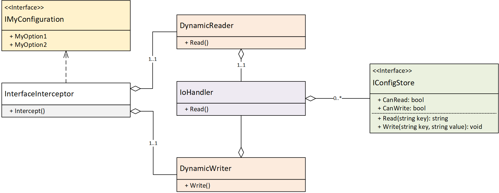

# Implementing a custom configuration store

Custom configuration store needs to be created when none of the built-in stores satisfy your requirements or you can't find an external NuGet package implementing what exactly you need. We always encourage you to contribute code to Config.Net repository instead of keeping it private, because open-source is good, and you should share!

Implementin a custom configuration store is dead simple by design in Config.Net. All you need is to impelement a class which implements `IConfigStore` interface. This library has built-in stores which should serve as starting points and examples through this journey.

In order to understand store architecture let's have a look at this diagram:



Note that this diagram is merely logical i.e. does not exactly reflect class names and you might want to browse the latest source code if you need to understand deep details.

Yellow interface `IMyConfiguration` is where your application starts reading config, by calling one of the properties or methods you've declared on the interface. This interface is backed by an `InterfaceInterceptor` which simply intercepts call to interface methods and mostly figures out what's the path to the property to read.

## Path

The path is expressed in dot-separated format such as:


- **ServerName** maps to just `ServerName` path as it's a root of your configuration.
- **Username** maps to `AdminCredentials.Username`
- etc.

Note that `IEnumerable<T>` is a special case and it's slightly more complicated, i.e. when you call `AdminCredentials.AllowedDays` Config.Net returns you a custom collection implementationn, but it also needs to know first what's the length of the collection. In order to do that it calls the store with a special path `AdminCredentials.AllowedDays.$l` where `$l` stands for `length` function. The store in turn return an integer number which is the size of the collection. When enumerating the collection, elements will be querid using path `AdminCredentials.AllowedDays[n]` where `n <= 0 < $l`.

## InterfaceInterceptor

This is an internal class that performs logic that builds property path from the property fetched or set on an interface, collection, property etc. This is where magic happens. Internall it consists of a set of helper classes to help it do so, mostly relying on reflection and some caching.

Note that internally there is an instance of `InterfaceInterceptor` per interface.

This uses two helper classes - `DynamicReader` and `DynamicWriter` which contain logic to read and write to the store respectively, and this logic is mostly concerned with creating variable path and handling .NET reflection use cases separately.

## IoHandler

`IoHandler` is another internal class which:

- Is used by the library to read or write property value by path.
- Always returns or accepts actual property value in property type, therefore internally there is logic to convert data types to and from a `string` which is the only type `IConfigStore` understands.
- Has a list of registered configuration stores.
- Decides which stores to read of write, based on whether they are readable or writeable.

## Custom Store

Ease of creating custom stores was the primary design goal of this library. We believe that it can only be useful when adding another configuration source is trivial.

In order to add a new store all you need to do is to implement `IConfigStore` interface which only has 4 moethods:

```csharp
   /// <summary>
   /// Configuration store interface
   /// </summary>
   public interface IConfigStore : IDisposable
   {
      /// <summary>
      /// Returns true if store supports read operation.
      /// </summary>
      bool CanRead { get; }

      /// <summary>
      /// Returns true if store supports write operation.
      /// </summary>
      bool CanWrite { get; }

      /// <summary>
      /// Reads a key from the store.
      /// </summary>
      /// <param name="key">Key name.</param>
      /// <returns>If key exists in the store returns the value, othwise returns null.</returns>
      string Read(string key);

      /// <summary>
      /// Writes a key to the store.
      /// </summary>
      /// <param name="key">Key name</param>
      /// <param name="value">Key value. Value of NULL usually means the key will be deleted, at least
      /// this is the recomendation for the custom store implementers.</param>
      void Write(string key, string value);
   }
```

As you can see there are two boolean properties which indicate whether your store is readable or writeable (or both).

`Read` and `Write` methods are also self-explanatory. The good thing about them is that you don't need to deal with types. Custom store only pushes and pulls string values, and Config.Net deals with type conversions internally. 

Once you're done, simply add the custom store during configuration build stage:

```csharp
_settings = new ConfigurationBuilder<IMySettings>()
   .UseConfigStore(new MyStore())
   .Build();
```