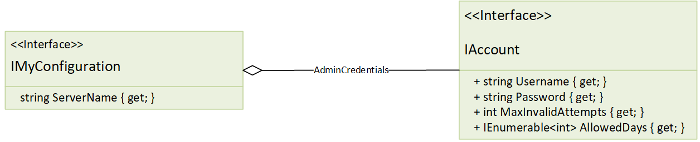

# Implementing a custom configuration store

Custom configuration store needs to be created when none of the built-in stores satisfy your requirements or you can't find an external NuGet package implementing what exactly you need. We always encourage you to contribute code to Config.Net repository instead of keeping it private, because open-source is good, and you should share!

Implementin a custom configuration store is dead simple by design in Config.Net. All you need is to impelement a class which implements `IConfigStore` interface. This library has built-in stores which should serve as starting points and examples through this journey.

In order to understand store architecture let's have a look at this diagram:

> pic

Note that this diagram is merely logical i.e. does not exactly reflect class names and you might want to browse the latest source code if you need to understand deep details.

Yellow interface `IMyConfiguration` is where your application starts reading config, by calling one of the properties or methods you've declared on the interface. This interface is backed by an `InterfaceInterceptor` which simply intercepts call to interface methods and mostly figures out what's the path to the property to read.

## Path

The path is expressed in dot-separated format such as:

- **ServerName** maps to just `ServerName` path as it's a root of your configuration.
- **Username** maps to `AdminCredentials.Username`
- etc.

Note that `IEnumerable<T>` is a special case and it's slightly more complicated, i.e. when you call `AdminCredentials.AllowedDays` Config.Net returns you a custom collection implementationn, but it also needs to know first what's the length of the collection. In order to do that it calls the store with a special path `AdminCredentials.AllowedDays.$l` where `$l` stands for `length` function. The store in turn return an integer number which is the size of the collection. When enumerating the collection, elements will be querid using path `AdminCredentials.AllowedDays[n]` where `n <= 0 < $l`.
