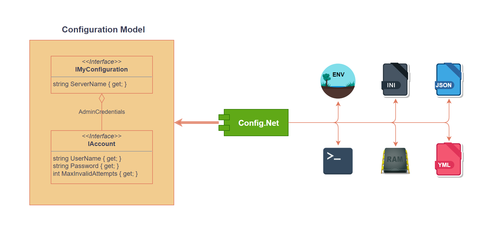

# Config.Net 

[](https://www.nuget.org/packages/Config.Net)   [](https://www.nuget.org/packages/Config.Net)

A comprehensive, easy to use and powerful .NET configuration library, fully covered with unit tests and tested in the wild on thousands of servers and applications.

This library eliminates the problem of having configuration in different places, having to convert types between different providers, hardcoding configuration keys across the solution, depending on specific configuration source implementation. It's doing that by exposing an abstract configuration interface and providing most common implementation for configuration sources like `app.config`, environment variables etc.



## Quick Start

Usually developers will hardcode reading configuration values from different sources like app.config, local json file etc. For instance, consider this code example:

```csharp
var clientId = ConfigurationManager.AppSettings["AuthClientId"];
var clientSecret = ConfigurationManager.AppSettings["AuthClientSecret"];
```

You would guess that this code is trying to read a configuration setting from the local app.config file by name and that might be true, however there are numerous problems with this approach:

* settings are referenced by a hardcoded string name which is prone to typos and therefore crashes in runtime.
* there is no easy way to find out where a particular setting is used in code, except for performing a fulltext search (provided that the string was not mistyped)
* if you decide to store configuration in a different place the code must be rewritten.

Welcome to Config.Net which solves most of those problems. Let's rewrite this abomination using Config.Net approach. First, we need to define a configuration container which describes which settings are used in your application or a library:


### Declare settings interface

```csharp
using Config.Net;

public interface IMySettings
{
    string AuthClientId { get; }

    string AuthClientSecret { get; }
}
```

These interface members describe the values you are using in code and look exactly like anything else in the code. You can pass this interface around inside your application like nothing happened.

In order to instantiate this interface and bind it to application settings use `ConfigurationBuilder<T>` class:

```csharp
IMySettings settings = new ConfigurationBuilder<IMySettings>()
   .UseAppConfig()
   .Build();
```

This is literally all you have to do. Configuration builder is an entry to creating instances of your interface and underneath it creates a proxy class which intercepts calls to properties and fetches values from underlying configured stores.

### Which Data Types are Supported?

Not all of the types can be used in the properties, because Config.Net needs to know how to convert them to and from the underlying stores. Out of the box basic .NET types (`bool`, `double`, `int`, `long`, `string`, `TimeSpan`, `DateTime`, `Uri`, `Guid`) are supported. Two more types are worth special mentioning:

#### `System.Net.NetworkCredential`

Is a handy built-in .NET class for holding information with username, password and domain. In reality those three fields are almost always enough to hold connection information to remote servers. The following format is understood: `username:password@domain` and all parts are optional.

#### String Arrays

Encoded using a command-line syntax:

- values are separated by a space i.e. `value1 value2`
- if you need spaces inside values you must take it in quotes i.e. `"value with space" valuewithoutspace`
- quotes inside values must be escaped using a double quote (`""`) and the value itself should be quoted i.e. `"value with ""quotes""""`

It's easy to add a new type by implementing `ITypeParser` interface.

### Using Multiple Sources

`ConfigurationBuilder<T>` is used to instantiate your configuration interface. You can use it to add multiple configuration sources. To get the list of sources use IntelliSense (type dot-Use):


The order in which sources are added is important - Config.Net will try to read the source in the configured order and return the value from the first store where it exists.

### Changing property behaviour

`Option` attribute can be used to annotate interface properties with extra behaviour.

#### Aliases

In case your property is named different to C# property name you can alias it:

```csharp
public interface IMySettings
{
   [Option(Alias = "clientId")]
   string AuthClientId { get; }
}
```

which makes Config.Net to look for "clientId" when reading or writing.

#### Default values

When a property doesn't exist in any of the stores or you just haven't configured any stores at all, you will receive a default value for the property type (0 for int, null for string etc.). However, it's sometimes useful to have a different value returned as a default instead of handling that in you code. In order to do that you can use the `DefaultValue` property on the attribute:

```csharp
public interface IMySettings
{
   [Option(Alias = "clientId", DefaultValue = "n/a")]
   string AuthClientId { get; }
}
```

Now when reading the value will be read as `n/a` instead of just `null`. `DefaultValue` property is of type `object` therefore the type of the value you assign to it must match the property type. If this is not the case, you will receive `InvalidCastException` explaining where the problem is during the `.Build()` stage.

However, you can set the property value to `string` no matter what the type is, as long as it's parseable to that type in runtime using any of the parsers.

##### DefaultValueAttribute

Config.Net also supports [`DefaultValueAttribute`](https://docs.microsoft.com/en-us/dotnet/api/system.componentmodel.defaultvalueattribute?view=netcore-3.1) as an alternative to specifying default values. This allows your interfaces not to have any dependency on Config.Net library. Following definitions have the same effect:

```csharp
public interface IMySettings
{
   [Option(DefaultValue = "n/a")]
   string AuthClientId { get; }
}
```

```csharp
public interface IMySettings
{
   [DefaultValue("n/a")]
   string AuthClientId { get; }
}
```

### Writing Settings

Some configuration stores support writing values. This can be checked by interrogating `IConfigStore.CanWrite` property. You can write the value back by simply setting it's value:

```csharp
c.AuthClientId = "new value";
```

Config.Net will write the value to all configured stores that support writing. If none of the stores support writing the call will be ignored.

Of course in order for a property to be writeable you need to declare it as such in the interface:

```csharp
string AuthClientId { get; set; }
```

## Nested Interfaces

Interfaces can be nested into each other. This is useful when you have a different set of similar settings and you don't want to redeclare them, for example let's say we want to store normal and admin credentials in a configuration storage.

First, we can declare an interface to store credentials in general:

```csharp
public interface ICreds
{
   string Username { get; }

   string Password { get; }
}
```

and contain it withing our configuration interface:

```csharp
public interface IConfig
{
   ICreds Admin { get; }

   ICreds Normal { get; }
}
```

then, instantiate `IConfig`:

```csharp
_config = new ConfigurationBuilder<IConfig>()
   .Use...
   .Build();
```

Now you can get credentials with a normal C# syntax, for instance to get admin username `_config.Admin.Username` etc. 

All the attributes are still applicable to nested interfaces.

When getting property values, each nesting level will be separated by a dot (`.`) for instance admin username is fetched by key `Admin.Username` - something to keep in mind when using flat configuration stores.

## Collections

Config.Net supports collections for primitive types and **interfaces**. 

Collection must be always declared as `IEnumerable<T>` and only have a getter.

At the moment collections are read-only and writing to collections may be supported at some point in future releases.

### Primitive Types

Suppose you want to read an array of integers, this can be declared as:

```csharp
interface IMyConfig
{
   IEnumerable<int> Numbers { get; }
}
```

### Interfaces

Reading an array of primitive types is not that interesting as you can always implement parsing yourself by storing some kind of a delimiter in a string i.e. `1,2,3,4` etc. Config.Net allows you to read a collection of your own complex types like so:

```csharp
interface ICredentials
{
   string Username { get; }
   string Password { get; }
}

interface IMyConfig
{
   IEnumerable<ICredentials> AllCredentials { get; }
}
```

### Limitations

Collections at the moment are only supported in read-only mode. All of the stores do support collections, however due to the nature of some underlying implementations complex collections are harder to represent and they are following the [flat line syntax](#flatline-syntax).

## Binding To Methods

Sometimes having just setters and getters is not enough or you need to get a configuration key by name you know only at runtime. That's where dynamic configuration comes in place.

With dynamic configuration you can declare methods in configuration interface, not just properties. Have a look at this example:

```csharp
public interface ICallableConfig
{
   string GetName(string keyName);
}
```

Calling the method will make Config.Net to read configuration using with key set to **Name**.*value of `keyName`*. For instance calling this method as `.GetName("my_key")` will return a value by key `Name.my_key`.

The first part of the key comes from the method name itself (any `Get` or `Set` method prefixes are removed automatically). The `[Option]` attribute applies here if you'd like to customise the key name i.e.

```csharp
public interface ICallableConfig
{
   [Option(Alias = "CustomName")]
   string GetName(string keyName);
}
```

changes the key to **CustomName**.*value of `keyName`*.

Please take a special note that if you call a method just `Get(string name)` Config.Net will read settings from a root namespace i.e. `Get("myprop")` will return a value by key `myprop`. Essentially this allows you to *read from the store dynamically*, however you are losing the ability of performing type safe conversions.

### Multiple Parameters

You can declare a method with as many parameters as you want, they will be simply chained together when deciding which key name to use, for example:


```csharp
public interface ICallableConfig
{
   string GetName(string keyName, string subKeyName);
}
```

will read configuration with key **Name**.*value of `keyName`*.*value of `subKeyName`* etc.

### Writing Values

The same way as you declare a method to read values, you can also declare methods for writing values. The only difference is that a method which writes values *must be void*. The last parameter of a writing method is considered a value parameter, for example:

```csharp
public interface ICallableConfig
{
   void SetName(string keyName, string value);
}
```

## INotifyPropertyChanged Support

INotifyPropertyChanged is part of .NET Framework and is often ised in situations when you want to monitor changes to a class' property. It is also an essential part of **Xamarin**, **WPF**, **UWP**, and **Windows Forms** data binding systems.

Config.Net totally supports `INPC` interface out of the box, and all you need to do is derive your interface from `INPC`:

```csharp
public interface IMyConfiguration : INotifyPropertyChanged
{
   string Name { get; set; }
}
```

then build your configuration as usual and subscribe to property changed event:

```csharp
IMyConfiguration config = new ConfigurationBuilder<IMyConfiguration>()
   //...
   .Build();

config.PropertyChanged += (sender, e) =>
{
   Assert.Equal("Name", e.PropertyName);
};

config.Name = "test";   //this will trigger PropertyChanged delegate
```

## Flatline Syntax

### Complex Structures

Many providers do not support nested structures. Suppose you have the following configuration declaration:

```csharp
//collection element
public interface IArrayElement
{
   string Username { get; }

   string Password { get; }
}

//top level configuration
public interface IConfig
{
   IEnumerable<IArrayElement> Creds { get; }
}
```

and you would like to to pass two elements which in json represent as follows:

```json
"Creds": [
   {
      "Username": "user1",
      "Password": "pass1"
   },
   {
      "Username": "user2",
      "Password":  "pass2"
   }
]
```

however you are using comman-line configuration provider which apparently has no nested structures. Config.Net sugggest something called a **flatline syntax** to be able to still use flat like providers and pass nested structures. an example above will translate to:

```bash
myapp.exe Creds.$l=2 Creds[0].Username=user1 Creds[0].Password=pass1 Creds[1].Username=user2 Creds[1].Password=pass2
```

which looks really expressive, however it still allows you to utilise nested structures. 

In practice you probably wouldn't use command like to pass large nested structures, but rather override some of the default parameters.

### Simple Structures

Simple structures can be represented by combining all the values on one single line. For instance the following configuration:

```csharp
public interface ISimpleArrays
{
   IEnumerable<int> Numbers { get; }
}
```

can be mapped to the following command line:

```bash
myapp.exe Numbers="1 2 3"
```

The syntax for providing multiple values in one parameter is identical to the one described in [command-line storage](#command-line).

## Configuration Sources

### AppConfig Store

To configure the store:

```csharp
IMySettings settings = new ConfigurationBuilder<IMySettings>()
   .UseAppConfig()
   .Build();
```

It doesn't have any parameters. It's read-only, and forwards read operation to the standard [ConfigurationManager](https://msdn.microsoft.com/en-us/library/system.configuration.configurationmanager%28v=vs.110%29.aspx?f=255&MSPPError=-2147217396) class.

- Keys are mapped straight to `<appSettings>` elements.
- If a key is not found in _appSettings_, an attempt will be made to find it in `<connectionStrings>`
- If it's still not found, and attempt will be made to find a section with a name before the first dot separator, and read the key from there.

To demonstrate this, consider the following example *app.config*:

```xml
<?xml version="1.0" encoding="utf-8" ?>
<configuration>
   <configSections>
      <section name="MySection" type="System.Configuration.NameValueSectionHandler"/>
   </configSections>
   <appSettings>
      <add key="AppKey" value="TestValue"/>
   </appSettings>
   <connectionStrings>
      <add name="MyConnection" connectionString="testconn"/>
   </connectionStrings>
   <MySection>
      <add key="MyKey" value="MyCustomValue"/>
   </MySection>
</configuration>
```

It can be mapped to configuration interface as follows:

```csharp
   public interface IConfig
   {
      string AppKey { get; }

      string MyConnection { get; }

      [Option(Alias = "MySection.MyKey")]
      string MySectionKey { get; }
   }
```

#### Collections

Collections are supported by using the [flatline syntax](#flatline-syntax).

### Command Line

This is in no way a command line framework but is rather an addition allowing you to pass configuration values explicitly on the command line.

To configure the store:

```csharp
IMySettings settings = new ConfigurationBuilder<IMySettings>()
   .UseCommandLine()
   .Build();
```

#### Conventions

This store will recognize any command line parameter which has a key-value delimiter in it (`=` or `:`) and optionally starts with a prefix `/` or `-` (the store trims these characters from the argument start).

If an argument has more than one delimiter the first one will be used.

#### Unnamed parameters

Parameters which are not named (don't have a delimiter) are skipped by default. If you wish to map a positional parameter to an option value you can specify an optional dictionary in configuration (see examples below).

#### Examples

##### Recognizable Parameters

`program.exe arg1=value1 arg2:value2 arg3:value:3 -arg4:value4` `--arg5:value5` `/arg6:value6`

all the parameters are valid and essentially will become the following:

- `arg1`:`value1`
- `arg2`:`value2`
- `arg3`:`value:3` - first delimiter used
- `arg4`:`value4`
- `arg5`:`value5`
- `arg6`:`value6`

##### Positional parameters

In many cases command line parameters do not have a name but still need to be captured, consider this example:

`myutil upload file1.txt`

this is much shorter than forcing user to specify command line like

`myutil /action=upload /filepath=file1.txt`

You can express the configuration to capture this in the following form:

```csharp
public interface IConsoleCommands
{
   [Option(DefaultValue = "download")]
   string Action { get; }

   string FilePath { get; }
}

//...


IConsoleCommands settings =
   new ConfigurationBuilder<IConsoleCommands>()
   .UseCommandLineArgs(
      new KeyValuePair<string, int>(nameof(IConsoleCommands.Action), 1),
      new KeyValuePair<string, int>(nameof(IConsoleCommands.FilePath), 2))
   .Build();
```

Note that the first command-line parameter starts with `1` not `0`.

#### Collections

Command line store also supports collections by using the [flatline syntax](#flatline-syntax).

### Environment Variables

To configure the store:

```csharp
IMySettings settings = new ConfigurationBuilder<IMySettings>()
   .UseEnvironmentVariables()
   .Build();
```

 This store works with system environment variables, the ones you get on Windows **cmd.exe** by typing `set` or in PowerShell by typing `Get-ChildItem Env:` or on Unix base systems `env`.

The store supports reading and writing environment variables.

> Note: Some systems like Visual Studio Team System Build replace dots (.) with underscores (_) when defining a variable. To overcome this the store will try to read the variable in both variants.

#### Collections

Collections are supported by using the [flatline syntax](#flatline-syntax).

### InMemory

To configure the store:

```csharp
IMySettings settings = new ConfigurationBuilder<IMySettings>()
   .UseInMemoryDictionary()
   .Build();
```

The store supports reading and writing, and stores configuration in the application memory. When application restarts all the setting values are lost. You may want to use this store for debugging or testing, other that that it has no real applications.

#### Collections

Collections are supported by using the [flatline syntax](#flatline-syntax).

### INI

#### Configuring

##### Mapping to file

```csharp
IMySettings settings = new ConfigurationBuilder<IMySettings>()
   .UseIniFile(filePath)
   .Build();
```

This variant supports reading and writing.

##### Mapping to file contents

```csharp
IMySettings settings = new ConfigurationBuilder<IMySettings>()
   .UseIniString(contentsOfAnIniFile)
   .Build();
```

This variant only supports reading as you are passing full file content immediately.

#### Using

The store fully supports INI file sections.

In the simplest form every key in the INI file corresponds to the name of an option. For instance a definition

```csharp
string MyOption { get; }
```

will correspond to a line in an INI file:

```ini
MyOption=my fancy value
```

#### Using Sections

A section corresponds to a part of option name before the first dot (.), for instance

```ini
[SectionOne]
MyOption=my fancy value
```

should use the definition

```csharp
[Option(Alias = "SectionOne.MyOption")]
string MyOption { get; }
```

##### Writing

Writing is straightforward, however note that if an option has a dot in the name a section will be created by default.

Both inline and newline comments are preserved on write:

```
key1=value1 ;this comment is preserved
;this comments is preserved too
```

##### Edge Cases

There are a few edge cases when working with INI files you should know about:

* A value can have an equal sign (`=`) and it will be considered a part of the value, because only the first equal sign is considered as a key-value separator.
* Apparently key names cannot contain `=`

###### A note on INI  comments

INI files consider semicolon (`;`) as an inline comment separator, therefore you cannot have it a part of a value. For instance a line like `key=value; this is a comment` in ideal INI implementation will be parsed out as

- key: `key`
- value: `value`
- comment: `comment`

However, in my experience, values like secrets, connection strings etc. _do_ often contain semicolons and in order to put them in an INI file you've got to do a trick like put a semicolon at the end of the value so that beforementioned string will become something like this `key=value; this is a comment;` to be parsed out as

- key: `key`
- value: `value; this is a commment`
- comment: *none*

Although this is absolutely valid and this is how INI files should work, it is often really frustrating as when you have a lot of values with semicolons you either have to check that they do contain semicolons and add a semicolon at the end, or just get used to adding semicolon at the end of every value. I believe neither of the solutions are practical, therefore since v**4.8.0** config.net does not parse inline comments by default (comment lines are still processed). This sorts out a lot of confusing questions around "why my value is not parsed correctly by config.net" or "this software is buggy" etc.

If you still want to revert to the old behavior, you can construct INI parser using the new signature:

```csharp
.UseIniFile(string iniFilePath, bool parseInlineComments = false);

// or

.UseIniString<TInterface>(string iniString, bool parseInlineComments = false);
```

and passing `true` to the last argument.

* If a value contains semicolon (`;`) which is a comment separator in INI files you should add it also as a last character in the value, because the parser considers only last `;` as a comment separator. For example `key=val;ue` wil be read as `val`, however `key=val;ue;` will be read as `val;ue`.

#### Collections

Collections are supported by using the [flatline syntax](#flatline-syntax).

### JSON

JSON is supported in read/write mode and is using `System.Text.Json.Nodes` namespace. For this reason it comes for free in .NET 6 and later, but will reference `System.Text.Json` nuget package v6 in earlier .NET versions.

> JSON store does **not** support writing collections as of yet, mostly due to lack of time to implement it properly.

#### Configuring

##### Mapping to file

```csharp
IMySettings settings = new ConfigurationBuilder<IMySettings>()
   .UseJsonFile(path)
   .Build();
```

This variant supports reading and writing. `Path` can be either relative or absolute.

##### Mapping to file contents

```csharp
IMySettings settings = new ConfigurationBuilder<IMySettings>()
   .UseJsonString(path)
   .Build();
```

This variant supports reading only as there is nowhere to write in this case.

#### Using

In the simplest form every key in the JSON file corresponds to the name of an option. For instance a definition

```csharp
public interface IMySettings
{
   string AuthClientId { get; }
   string AuthClientSecreat { get; }
}
```

will correspond to the following JSON file:

``` json
{
   "AuthClientId": "Id",
   "AuthClientSecret": "Secret"
}
```

##### Using a setting that has a non trivial JSON Path

In a more advanced, and probably more typical scenario, the JSON setting will be nested within the configuration structure in a non trivial way (i.e., not on the root with an identical name). The Option attribute, combined with Alias property, specifies the JSON Path needed in order to reach the setting's value.

```csharp
public interface IMySettings
{
   string AuthClientId { get; }
   string AuthClientSecreat { get; }
   
   [Option(Alias = "WebService.Host")]
   string ExternalWebServiceHost { get; }
}
```

will correspond to the following JSON file:

``` json
{
   "AuthClientId":"Id",
   "AuthClientSecret":"Secret",
   
   "WebService": {
       "Host": "http://blahblah.com:3000"
   }
}
```

## Using With

### Azure Functions

Azure function [configuration](https://docs.microsoft.com/en-us/azure/azure-functions/functions-how-to-use-azure-function-app-settings?tabs=portal) can be set in portal or settings file when developing locally. This is just a pure magic and they are all exposed as environment variables at the end of the day. `.UseEnvironmentVariables()` will allow to read those values.

## Sponsorship

This framework is free and can be used for free, open source and commercial applications. Config.Net (all code, NuGets and binaries) are under the [MIT License (MIT)](https://github.com/aloneguid/config/blob/master/LICENSE). It's battle-tested and used by many awesome people and organisations. So hit the magic ⭐️ button, we appreciate it!!! 🙏 Thx!

The core team members, Config.Net contributors and contributors in the ecosystem do this open source work in their free time. If you use Config.Net, and you'd like us to invest more time on it, please donate. This project increases your income/productivity/usabilty too.

### Why charge/sponsor for open source?

 * [Open-Source Maintainers are Jerks! | Nick Randolph & Geoffrey Huntley](https://vimeo.com/296579853)
 * [FOSS is free as in toilet | Geoffroy Couprie](http://unhandledexpression.com/general/2018/11/27/foss-is-free-as-in-toilet.html)
 * [How to Charge for your Open Source | Mike Perham](https://www.mikeperham.com/2015/11/23/how-to-charge-for-your-open-source/)
 * [Sustain OSS: The Report](https://sustainoss.org/assets/pdf/SustainOSS-west-2017-report.pdf)
 * [Open Source Maintainers Owe You Nothing | Mike McQuaid](https://mikemcquaid.com/2018/03/19/open-source-maintainers-owe-you-nothing/)
 * [Who should fund open source projects? | Jane Elizabeth](https://jaxenter.com/who-funds-open-source-projects-133222.html)
 * [Apply at OSS Inc today| Ryan Chenkie](https://twitter.com/ryanchenkie/status/1067801413974032385)
 * [The Ethics of Unpaid Labor and the OSS Community | Ashe Dryden](https://www.ashedryden.com/blog/the-ethics-of-unpaid-labor-and-the-oss-community)

### Backers

Become a backer and show your support to our open source project.

[](https://opencollective.com/config#support)

### Sponsors

Does your company use Config.Net?  Ask your manager or marketing team if your company would be interested in supporting our project.  Support will allow the maintainers to dedicate more time for maintenance and new features for everyone.  Also, your company's logo will show here - who doesn't want a little extra exposure?

[](https://opencollective.com/config#sponsor)


## Special Thanks

Thanks to [JetBrains](https://www.jetbrains.com) for kindly providing an open-source license to their amazing [Rider IDE](https://www.jetbrains.com/rider/) for Open Source Development.

